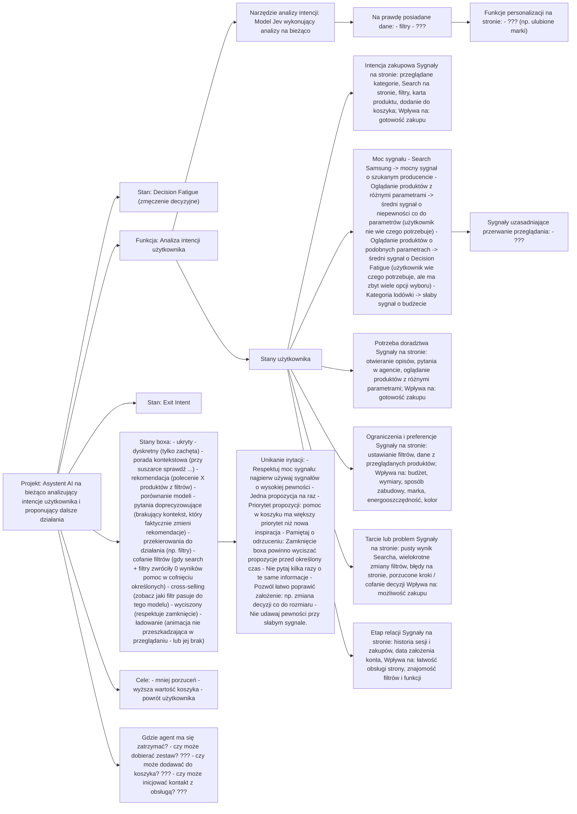

# Tablica

Żywy schemat projektu. Źródłem rysunku jest `board.drawio`. Ten plik jest z niego wygenerowany.

## Graph

Source: `context/foundation/board.drawio`

### sciezka

Page: Draft

#### Nodes

| id | label |
| --- | --- |
| BHXNnO2DprNrXNOJPkzE-9 | Projekt: Asystent AI na bieżąco analizujący intencje użytkownika i proponujący dalsze działania |
| BHXNnO2DprNrXNOJPkzE-10 | Stan: Decision Fatigue (zmęczenie decyzyjne) |
| BHXNnO2DprNrXNOJPkzE-12 | Funkcja: Analiza intencji użytkownika |
| BHXNnO2DprNrXNOJPkzE-14 | Narzędzie analizy intencji: Model Jev wykonujący analizy na bieżąco |
| QpSfiPSOI_3kDt8jnSOE-1 | Stany użytkownika |
| QpSfiPSOI_3kDt8jnSOE-4 | Stan: Exit Intent |
| Uq7As5gmzwwlNb1xTZ3C-1 | Intencja zakupowa Sygnały na stronie: przeglądane kategorie, Search na stronie, filtry, karta produktu, dodanie do koszyka; Wpływa na: gotowość zakupu |
| Uq7As5gmzwwlNb1xTZ3C-4 | Moc sygnału - Search Samsung -> mocny sygnał o szukanym producencie - Oglądanie produktów z różnymi parametrami -> średni sygnał o niepewności co do parametrów (użytkownik nie wie czego potrzebuje) - Oglądanie produktów o podobnych parametrach -> średni sygnał o Decision Fatigue (użytkownik wie czego potrzebuje, ale ma zbyt wiele opcji wyboru) - Kategoria lodówki -> słaby sygnał o budżecie |
| Uq7As5gmzwwlNb1xTZ3C-6 | Potrzeba doradztwa Sygnały na stronie: otwieranie opisów, pytania w agencie, oglądanie produktów z różnymi parametrami; Wpływa na: gotowość zakupu |
| Uq7As5gmzwwlNb1xTZ3C-8 | Ograniczenia i preferencje Sygnały na stronie: ustawianie filtrów, dane z przeglądanych produktów; Wpływa na: budżet, wymiary, sposób zabudowy, marka, energooszczędność, kolor |
| Uq7As5gmzwwlNb1xTZ3C-10 | Tarcie lub problem Sygnały na stronie: pusty wynik Searcha, wielokrotne zmiany filtrów, błędy na stronie, porzucone kroki / cofanie decyzji Wpływa na: możliwość zakupu |
| Uq7As5gmzwwlNb1xTZ3C-14 | Etap relacji Sygnały na stronie: historia sesji i zakupów, data założenia konta, Wpływa na: łatwość obsługi strony, znajomość filtrów i funkcji |
| Uq7As5gmzwwlNb1xTZ3C-16 | Stany boxa: - ukryty - dyskretny (tylko zachęta) - porada kontekstowa (przy suszarce sprawdź ...) - rekomendacja (polecenie X produktów z filtrów) - porównanie modeli - pytania doprecyzowujące (brakujący kontekst, który faktycznie zmieni rekomendacje) - przekierowania do działania (np. filtry) - cofanie filtrów (gdy search + filtry zwróciły 0 wyników pomoc w cofnięciu określonych) - cross-selling (zobacz jaki filtr pasuje do tego modelu) - wyciszony (respektuje zamknięcie) - ładowanie (animacja nie przeszkadzająca w przeglądaniu - lub jej brak) |
| Uq7As5gmzwwlNb1xTZ3C-22 | Unikanie irytacji: - Respektuj moc sygnału: najpierw używaj sygnałów o wysokiej pewności - Jedna propozycja na raz - Priorytet propozycji: pomoc w koszyku ma większy priorytet niż nowa inspiracja - Pamiętaj o odrzuceniu: Zamknięcie boxa powinno wyciszać propozycje przed określony czas - Nie pytaj kilka razy o te same informacje - Pozwól łatwo poprawić założenie: np. zmiana decyzji co do rozmiaru - Nie udawaj pewności przy słabym sygnale. |
| Uq7As5gmzwwlNb1xTZ3C-24 | Cele: - mniej porzuceń - wyższa wartość koszyka - powrót użytkownika |
| Uq7As5gmzwwlNb1xTZ3C-26 | Sygnały uzasadniające przerwanie przeglądania: - ??? |
| Uq7As5gmzwwlNb1xTZ3C-29 | Na prawdę posiadane dane: - filtry - ??? |
| Uq7As5gmzwwlNb1xTZ3C-32 | Funkcje personalizacji na stronie: - ??? (np. ulubione marki) |
| Uq7As5gmzwwlNb1xTZ3C-36 | Gdzie agent ma się zatrzymać? - czy może dobierać zestaw? ??? - czy może dodawać do koszyka? ??? - czy może inicjować kontakt z obsługą? ??? |

#### Edges

| id | from | to | label |
| --- | --- | --- | --- |
| BHXNnO2DprNrXNOJPkzE-11 | BHXNnO2DprNrXNOJPkzE-9 | BHXNnO2DprNrXNOJPkzE-10 | |
| BHXNnO2DprNrXNOJPkzE-13 | BHXNnO2DprNrXNOJPkzE-9 | BHXNnO2DprNrXNOJPkzE-12 | |
| QpSfiPSOI_3kDt8jnSOE-5 | BHXNnO2DprNrXNOJPkzE-9 | QpSfiPSOI_3kDt8jnSOE-4 | |
| Uq7As5gmzwwlNb1xTZ3C-17 | BHXNnO2DprNrXNOJPkzE-9 | Uq7As5gmzwwlNb1xTZ3C-16 | |
| Uq7As5gmzwwlNb1xTZ3C-25 | BHXNnO2DprNrXNOJPkzE-9 | Uq7As5gmzwwlNb1xTZ3C-24 | |
| Uq7As5gmzwwlNb1xTZ3C-37 | BHXNnO2DprNrXNOJPkzE-9 | Uq7As5gmzwwlNb1xTZ3C-36 | |
| BHXNnO2DprNrXNOJPkzE-15 | BHXNnO2DprNrXNOJPkzE-12 | BHXNnO2DprNrXNOJPkzE-14 | |
| QpSfiPSOI_3kDt8jnSOE-2 | BHXNnO2DprNrXNOJPkzE-12 | QpSfiPSOI_3kDt8jnSOE-1 | |
| Uq7As5gmzwwlNb1xTZ3C-30 | BHXNnO2DprNrXNOJPkzE-14 | Uq7As5gmzwwlNb1xTZ3C-29 | |
| Uq7As5gmzwwlNb1xTZ3C-2 | QpSfiPSOI_3kDt8jnSOE-1 | Uq7As5gmzwwlNb1xTZ3C-1 | |
| Uq7As5gmzwwlNb1xTZ3C-5 | QpSfiPSOI_3kDt8jnSOE-1 | Uq7As5gmzwwlNb1xTZ3C-4 | |
| Uq7As5gmzwwlNb1xTZ3C-7 | QpSfiPSOI_3kDt8jnSOE-1 | Uq7As5gmzwwlNb1xTZ3C-6 | |
| Uq7As5gmzwwlNb1xTZ3C-9 | QpSfiPSOI_3kDt8jnSOE-1 | Uq7As5gmzwwlNb1xTZ3C-8 | |
| Uq7As5gmzwwlNb1xTZ3C-11 | QpSfiPSOI_3kDt8jnSOE-1 | Uq7As5gmzwwlNb1xTZ3C-10 | |
| Uq7As5gmzwwlNb1xTZ3C-15 | QpSfiPSOI_3kDt8jnSOE-1 | Uq7As5gmzwwlNb1xTZ3C-14 | |
| Uq7As5gmzwwlNb1xTZ3C-27 | Uq7As5gmzwwlNb1xTZ3C-4 | Uq7As5gmzwwlNb1xTZ3C-26 | |
| Uq7As5gmzwwlNb1xTZ3C-23 | Uq7As5gmzwwlNb1xTZ3C-16 | Uq7As5gmzwwlNb1xTZ3C-22 | |
| Uq7As5gmzwwlNb1xTZ3C-33 | Uq7As5gmzwwlNb1xTZ3C-29 | Uq7As5gmzwwlNb1xTZ3C-32 | |

#### View



### h4vQV3dBPn90pVBm1vDd

Page: Projekt

#### Nodes

| id | label |
| --- | --- |

#### Edges

| id | from | to | label |
| --- | --- | --- | --- |

#### View

```mermaid
flowchart LR
```

## Journal

### B-001

- status: stale
- claim: Projekt: Asystent AI na bieżąco analizujący intencje użytkownika i proponujący dalsze działania prowadzi do Problem: Decision Fatigue (zmęczenie decyzyjne).
- because: Strzałka bez etykiety łączy pole projektu z polem problemu.
- covers: sciezka:BHXNnO2DprNrXNOJPkzE-9, sciezka:BHXNnO2DprNrXNOJPkzE-11, sciezka:BHXNnO2DprNrXNOJPkzE-10
- supersedes:
- created: 2026-10-02

### B-002

- status: decision
- claim: Projekt: Asystent AI na bieżąco analizujący intencje użytkownika i proponujący dalsze działania prowadzi do Funkcja: Analiza intencji użytkownika.
- because: Strzałka bez etykiety łączy pole projektu z polem funkcji.
- covers: sciezka:BHXNnO2DprNrXNOJPkzE-9, sciezka:BHXNnO2DprNrXNOJPkzE-13, sciezka:BHXNnO2DprNrXNOJPkzE-12
- supersedes:
- created: 2026-10-02

### B-003

- status: decision
- claim: Funkcja: Analiza intencji użytkownika prowadzi do Narzędzie analizy intencji: Model Jev wykonujący analizy na bieżąco.
- because: Strzałka bez etykiety łączy pole funkcji z polem narzędzia.
- covers: sciezka:BHXNnO2DprNrXNOJPkzE-12, sciezka:BHXNnO2DprNrXNOJPkzE-15, sciezka:BHXNnO2DprNrXNOJPkzE-14
- supersedes:
- created: 2026-10-02

### B-004

- status: stale
- claim: Funkcja: Analiza intencji użytkownika prowadzi do Intencje: - Exit Intent- Decision Fatigue.
- because: Strzałka bez etykiety łączy pole funkcji z polem intencji.
- covers: sciezka:BHXNnO2DprNrXNOJPkzE-12, sciezka:BHXNnO2DprNrXNOJPkzE-17, sciezka:BHXNnO2DprNrXNOJPkzE-16
- supersedes:
- created: 2026-10-02

### B-005

- status: decision
- claim: Projekt: Asystent AI na bieżąco analizujący intencje użytkownika i proponujący dalsze działania prowadzi do Stan: Decision Fatigue (zmęczenie decyzyjne).
- because: Strzałka bez etykiety łączy pole projektu z polem stanu.
- covers: sciezka:BHXNnO2DprNrXNOJPkzE-9, sciezka:BHXNnO2DprNrXNOJPkzE-11, sciezka:BHXNnO2DprNrXNOJPkzE-10
- supersedes: B-001
- created: 2026-10-03

### B-006

- status: decision
- claim: Funkcja: Analiza intencji użytkownika prowadzi do Stany użytkownika.
- because: Strzałka bez etykiety łączy pole funkcji z polem stanów użytkownika.
- covers: sciezka:BHXNnO2DprNrXNOJPkzE-12, sciezka:QpSfiPSOI_3kDt8jnSOE-2, sciezka:QpSfiPSOI_3kDt8jnSOE-1
- supersedes:
- created: 2026-10-03

### B-007

- status: decision
- claim: Projekt: Asystent AI na bieżąco analizujący intencje użytkownika i proponujący dalsze działania prowadzi do Stan: Exit Intent.
- because: Strzałka bez etykiety łączy pole projektu z polem stanu Exit Intent.
- covers: sciezka:BHXNnO2DprNrXNOJPkzE-9, sciezka:QpSfiPSOI_3kDt8jnSOE-5, sciezka:QpSfiPSOI_3kDt8jnSOE-4
- supersedes:
- created: 2026-10-03

### B-008

- status: decision
- claim: Stany użytkownika prowadzą do Intencja zakupowa, której sygnały na stronie to przeglądane kategorie, Search na stronie, filtry, karta produktu i dodanie do koszyka, a wpływ jest na gotowość zakupu.
- because: Strzałka bez etykiety łączy pole stanów użytkownika z polem intencji zakupowej, które wymienia te sygnały i ten wpływ.
- covers: sciezka:QpSfiPSOI_3kDt8jnSOE-1, sciezka:Uq7As5gmzwwlNb1xTZ3C-2, sciezka:Uq7As5gmzwwlNb1xTZ3C-1
- supersedes:
- created: 2026-10-03

### B-009

- status: decision
- claim: Stany użytkownika prowadzą do Moc sygnału: Search Samsung to mocny sygnał o szukanym producencie, oglądanie produktów z różnymi parametrami to średni sygnał o niepewności co do parametrów (użytkownik nie wie czego potrzebuje), oglądanie produktów o podobnych parametrach to średni sygnał o Decision Fatigue (użytkownik wie czego potrzebuje, ale ma zbyt wiele opcji wyboru), a kategoria lodówki to słaby sygnał o budżecie.
- because: Strzałka bez etykiety łączy pole stanów użytkownika z polem mocy sygnału, które wymienia te cztery odczyty.
- covers: sciezka:QpSfiPSOI_3kDt8jnSOE-1, sciezka:Uq7As5gmzwwlNb1xTZ3C-5, sciezka:Uq7As5gmzwwlNb1xTZ3C-4
- supersedes:
- created: 2026-10-03

### B-010

- status: decision
- claim: Stany użytkownika prowadzą do Potrzeba doradztwa, której sygnały na stronie to otwieranie opisów, pytania w agencie i oglądanie produktów z różnymi parametrami, a wpływ jest na gotowość zakupu.
- because: Strzałka bez etykiety łączy pole stanów użytkownika z polem potrzeby doradztwa, które wymienia te sygnały i ten wpływ.
- covers: sciezka:QpSfiPSOI_3kDt8jnSOE-1, sciezka:Uq7As5gmzwwlNb1xTZ3C-7, sciezka:Uq7As5gmzwwlNb1xTZ3C-6
- supersedes:
- created: 2026-10-03

### B-011

- status: decision
- claim: Stany użytkownika prowadzą do Ograniczenia i preferencje, których sygnały na stronie to ustawianie filtrów i dane z przeglądanych produktów, a wpływ jest na budżet, wymiary, sposób zabudowy, markę, energooszczędność i kolor.
- because: Strzałka bez etykiety łączy pole stanów użytkownika z polem ograniczeń i preferencji, które wymienia te sygnały i ten wpływ.
- covers: sciezka:QpSfiPSOI_3kDt8jnSOE-1, sciezka:Uq7As5gmzwwlNb1xTZ3C-9, sciezka:Uq7As5gmzwwlNb1xTZ3C-8
- supersedes:
- created: 2026-10-03

### B-012

- status: decision
- claim: Stany użytkownika prowadzą do Tarcie lub problem, którego sygnały na stronie to pusty wynik Searcha, wielokrotne zmiany filtrów, błędy na stronie i porzucone kroki / cofanie decyzji, a wpływ jest na możliwość zakupu.
- because: Strzałka bez etykiety łączy pole stanów użytkownika z polem tarcia lub problemu, które wymienia te sygnały i ten wpływ.
- covers: sciezka:QpSfiPSOI_3kDt8jnSOE-1, sciezka:Uq7As5gmzwwlNb1xTZ3C-11, sciezka:Uq7As5gmzwwlNb1xTZ3C-10
- supersedes:
- created: 2026-10-03

### B-013

- status: decision
- claim: Stany użytkownika prowadzą do Etap relacji, którego sygnały na stronie to historia sesji i zakupów oraz data założenia konta, a wpływ jest na łatwość obsługi strony i znajomość filtrów i funkcji.
- because: Strzałka bez etykiety łączy pole stanów użytkownika z polem etapu relacji, które wymienia te sygnały i ten wpływ.
- covers: sciezka:QpSfiPSOI_3kDt8jnSOE-1, sciezka:Uq7As5gmzwwlNb1xTZ3C-15, sciezka:Uq7As5gmzwwlNb1xTZ3C-14
- supersedes:
- created: 2026-10-03

### B-014

- status: decision
- claim: Projekt: Asystent AI na bieżąco analizujący intencje użytkownika i proponujący dalsze działania prowadzi do Stany boxa: ukryty, dyskretny (tylko zachęta), porada kontekstowa (przy suszarce sprawdź ...), rekomendacja (polecenie X produktów z filtrów), porównanie modeli, pytania doprecyzowujące (brakujący kontekst, który faktycznie zmieni rekomendacje), przekierowania do działania (np. filtry), cofanie filtrów (gdy search + filtry zwróciły 0 wyników pomoc w cofnięciu określonych), cross-selling (zobacz jaki filtr pasuje do tego modelu), wyciszony (respektuje zamknięcie) i ładowanie (animacja nie przeszkadzająca w przeglądaniu - lub jej brak).
- because: Strzałka bez etykiety łączy pole projektu z polem stanów boxa, które wymienia te stany.
- covers: sciezka:BHXNnO2DprNrXNOJPkzE-9, sciezka:Uq7As5gmzwwlNb1xTZ3C-17, sciezka:Uq7As5gmzwwlNb1xTZ3C-16
- supersedes:
- created: 2026-10-03

### B-015

- status: decision
- claim: Stany boxa prowadzą do Unikanie irytacji: respektuj moc sygnału (najpierw używaj sygnałów o wysokiej pewności), jedna propozycja na raz, priorytet propozycji (pomoc w koszyku ma większy priorytet niż nowa inspiracja), pamiętaj o odrzuceniu (zamknięcie boxa powinno wyciszać propozycje przed określony czas), nie pytaj kilka razy o te same informacje, pozwól łatwo poprawić założenie (np. zmiana decyzji co do rozmiaru) i nie udawaj pewności przy słabym sygnale.
- because: Strzałka bez etykiety łączy pole stanów boxa z polem unikania irytacji, które wymienia te zasady.
- covers: sciezka:Uq7As5gmzwwlNb1xTZ3C-16, sciezka:Uq7As5gmzwwlNb1xTZ3C-23, sciezka:Uq7As5gmzwwlNb1xTZ3C-22
- supersedes:
- created: 2026-10-03

### B-016

- status: decision
- claim: Projekt: Asystent AI na bieżąco analizujący intencje użytkownika i proponujący dalsze działania prowadzi do Cele: mniej porzuceń, wyższa wartość koszyka i powrót użytkownika.
- because: Strzałka bez etykiety łączy pole projektu z polem celów, które wymienia te trzy punkty.
- covers: sciezka:BHXNnO2DprNrXNOJPkzE-9, sciezka:Uq7As5gmzwwlNb1xTZ3C-25, sciezka:Uq7As5gmzwwlNb1xTZ3C-24
- supersedes:
- created: 2026-10-03

### B-017

- status: open
- claim: Moc sygnału prowadzi do Sygnały uzasadniające przerwanie przeglądania: - ???.
- because: Strzałka bez etykiety łączy pole mocy sygnału z polem, które zostawia sygnały jako ???.
- covers: sciezka:Uq7As5gmzwwlNb1xTZ3C-4, sciezka:Uq7As5gmzwwlNb1xTZ3C-27, sciezka:Uq7As5gmzwwlNb1xTZ3C-26
- supersedes:
- created: 2026-10-03

### B-018

- status: open
- claim: Narzędzie analizy intencji: Model Jev wykonujący analizy na bieżąco prowadzi do Na prawdę posiadane dane: - filtry - ???.
- because: Strzałka bez etykiety łączy pole narzędzia z polem danych, które wymienia filtry i zostawia resztę jako ???.
- covers: sciezka:BHXNnO2DprNrXNOJPkzE-14, sciezka:Uq7As5gmzwwlNb1xTZ3C-30, sciezka:Uq7As5gmzwwlNb1xTZ3C-29
- supersedes:
- created: 2026-10-03

### B-019

- status: open
- claim: Na prawdę posiadane dane: - filtry - ??? prowadzi do Funkcje personalizacji na stronie: - ??? (np. ulubione marki).
- because: Strzałka bez etykiety łączy pole posiadanych danych z polem personalizacji, które zostawia funkcje jako ???.
- covers: sciezka:Uq7As5gmzwwlNb1xTZ3C-29, sciezka:Uq7As5gmzwwlNb1xTZ3C-33, sciezka:Uq7As5gmzwwlNb1xTZ3C-32
- supersedes:
- created: 2026-10-03

### B-020

- status: open
- claim: Projekt: Asystent AI na bieżąco analizujący intencje użytkownika i proponujący dalsze działania prowadzi do Gdzie agent ma się zatrzymać? - czy może dobierać zestaw? ??? - czy może dodawać do koszyka? ??? - czy może inicjować kontakt z obsługą? ???.
- because: Strzałka bez etykiety łączy pole projektu z polem, które jest pytaniem i oznacza trzy punkty jako ???.
- covers: sciezka:BHXNnO2DprNrXNOJPkzE-9, sciezka:Uq7As5gmzwwlNb1xTZ3C-37, sciezka:Uq7As5gmzwwlNb1xTZ3C-36
- supersedes:
- created: 2026-10-03
