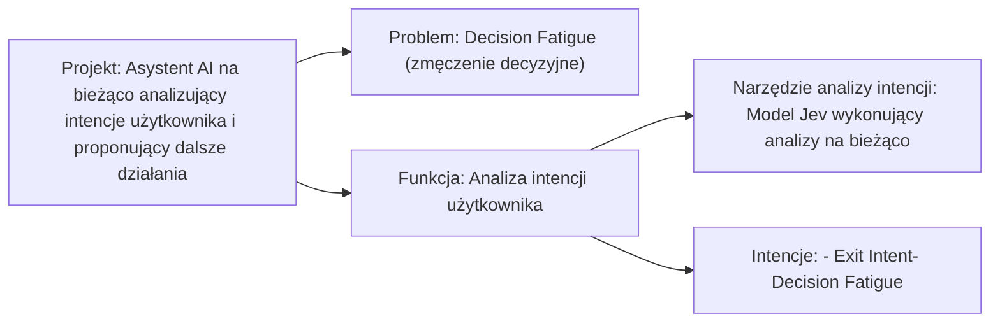

# Tablica

Żywy schemat projektu. Źródłem rysunku jest `board.drawio`. Ten plik jest z niego wygenerowany.

## Graph

Source: `context/foundation/board.drawio`

### sciezka

Page: Projekt

#### Nodes

| id | label |
| --- | --- |
| BHXNnO2DprNrXNOJPkzE-9 | Projekt: Asystent AI na bieżąco analizujący intencje użytkownika i proponujący dalsze działania |
| BHXNnO2DprNrXNOJPkzE-10 | Problem: Decision Fatigue (zmęczenie decyzyjne) |
| BHXNnO2DprNrXNOJPkzE-12 | Funkcja: Analiza intencji użytkownika |
| BHXNnO2DprNrXNOJPkzE-14 | Narzędzie analizy intencji: Model Jev wykonujący analizy na bieżąco |
| BHXNnO2DprNrXNOJPkzE-16 | Intencje: - Exit Intent- Decision Fatigue |

#### Edges

| id | from | to | label |
| --- | --- | --- | --- |
| BHXNnO2DprNrXNOJPkzE-11 | BHXNnO2DprNrXNOJPkzE-9 | BHXNnO2DprNrXNOJPkzE-10 | |
| BHXNnO2DprNrXNOJPkzE-13 | BHXNnO2DprNrXNOJPkzE-9 | BHXNnO2DprNrXNOJPkzE-12 | |
| BHXNnO2DprNrXNOJPkzE-15 | BHXNnO2DprNrXNOJPkzE-12 | BHXNnO2DprNrXNOJPkzE-14 | |
| BHXNnO2DprNrXNOJPkzE-17 | BHXNnO2DprNrXNOJPkzE-12 | BHXNnO2DprNrXNOJPkzE-16 | |

#### View

## Journal

### B-001

- status: decision
- claim: Projekt: Asystent AI na bieżąco analizujący intencje użytkownika i proponujący dalsze działania prowadzi do Problem: Decision Fatigue (zmęczenie decyzyjne).
- because: Strzałka bez etykiety łączy pole projektu z polem problemu.
- covers: sciezka:BHXNnO2DprNrXNOJPkzE-9, sciezka:BHXNnO2DprNrXNOJPkzE-11, sciezka:BHXNnO2DprNrXNOJPkzE-10
- supersedes:
- created: 2026-10-02

### B-002

- status: decision
- claim: Projekt: Asystent AI na bieżąco analizujący intencje użytkownika i proponujący dalsze działania prowadzi do Funkcja: Analiza intencji użytkownika.
- because: Strzałka bez etykiety łączy pole projektu z polem funkcji.
- covers: sciezka:BHXNnO2DprNrXNOJPkzE-9, sciezka:BHXNnO2DprNrXNOJPkzE-13, sciezka:BHXNnO2DprNrXNOJPkzE-12
- supersedes:
- created: 2026-10-02

### B-003

- status: decision
- claim: Funkcja: Analiza intencji użytkownika prowadzi do Narzędzie analizy intencji: Model Jev wykonujący analizy na bieżąco.
- because: Strzałka bez etykiety łączy pole funkcji z polem narzędzia.
- covers: sciezka:BHXNnO2DprNrXNOJPkzE-12, sciezka:BHXNnO2DprNrXNOJPkzE-15, sciezka:BHXNnO2DprNrXNOJPkzE-14
- supersedes:
- created: 2026-10-02

### B-004

- status: decision
- claim: Funkcja: Analiza intencji użytkownika prowadzi do Intencje: - Exit Intent- Decision Fatigue.
- because: Strzałka bez etykiety łączy pole funkcji z polem intencji.
- covers: sciezka:BHXNnO2DprNrXNOJPkzE-12, sciezka:BHXNnO2DprNrXNOJPkzE-17, sciezka:BHXNnO2DprNrXNOJPkzE-16
- supersedes:
- created: 2026-10-02
